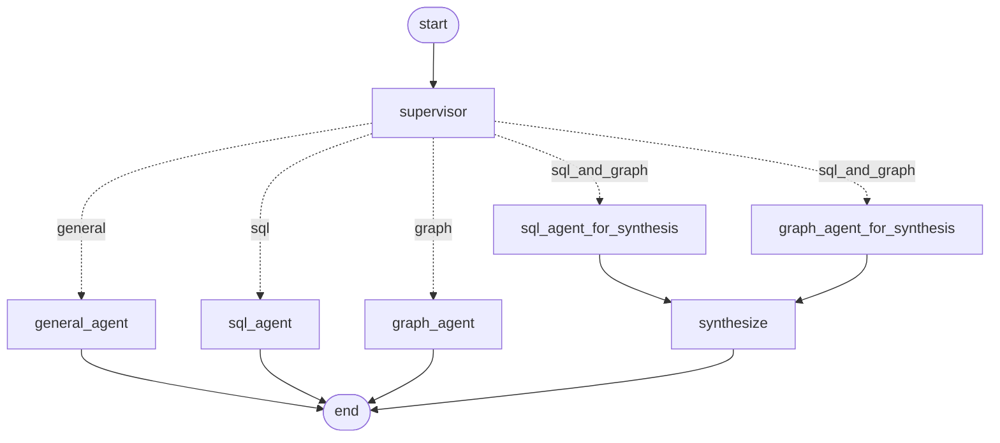

# RetailAsk — Multi-Agent Retail Analytics

RetailAsk lets a **retail store owner** ask business questions in plain English and get answers grounded in their own data:

- *"How much revenue did we make?"*
- *"Which products have quality issues?"*
- *"Which high-selling products also have negative feedback?"*

A **Supervisor agent** decides what kind of question it is and routes it to a specialized agent: a **SQL Agent** for metrics from MySQL, a **Graph Agent** for relationships in a Neo4j business graph, or **both**, with a synthesis step that merges the two results into one answer.

It's built for business analytics, not end-customer support.

**Stack:** React · Flask · **LangGraph** (agent orchestration) · MySQL (Aiven) · Neo4j (Aura) · sentence-transformers (MiniLM) · any OpenAI-compatible LLM (Groq by default; Ollama or Hugging Face optional)

---

## Architecture

```
                          User question (React UI → POST /query)
                                        │
                                        ▼
                           ┌────────────────────────┐
                           │   Supervisor Agent     │  LLM → JSON route + reason
                           └────────────────────────┘
          ┌──────────────┬──────────────┴───────────────┬──────────────┐
          ▼              ▼                              ▼              ▼
        "sql"         "graph"                     "sql_and_graph"   "general"
          │              │                              │              │
          ▼              ▼                     SQL Agent + Graph Agent  No data access
     SQL Agent      Graph Agent                          │
   ┌───────────┐  ┌────────────────┐                     ▼
   │Schema RAG │  │Intent parser   │           ┌──────────────────┐
   │(MiniLM)   │  │(deterministic) │           │ Synthesis (LLM)  │
   │LLM → SQL  │  │Cypher → Neo4j  │           │ merges both      │
   │SELECT-only│  │LLM answer from │           │ results          │
   │guard      │  │graph facts     │           └──────────────────┘
   │MySQL      │  └────────────────┘
   │LLM explain│
   └───────────┘
                                        │
                                        ▼
                 Answer + route + pipeline steps + SQL rows / graph facts
                       (shown in the UI's "Agent Pipeline" panel)
```

| Component | Code | What it does |
|---|---|---|
| Supervisor | `Backend/agents/supervisor.py` | One LLM call that returns `{"route", "reason"}`. Invalid output falls back to `general`. |
| SQL Agent | `Backend/agents/sql_agent.py` | Schema RAG → LLM writes one MySQL `SELECT` → safety check → run → LLM explains the rows. |
| Graph Agent | `Backend/agents/graph_agent.py` | Deterministic intent parser → parameterized Cypher on Neo4j → LLM answers **only** from the retrieved facts. |
| Orchestrator (LangGraph) | `Backend/agents/langgraph_orchestrator.py` | The workflow as a LangGraph `StateGraph`: Supervisor node → conditional edge per route; for `sql_and_graph` the SQL and Graph agents run **in parallel** and join into a synthesis node. Default engine. |
| Orchestrator (shared + fallback) | `Backend/agents/orchestrator.py` | Shared routing/synthesis helpers, `run_question()` entry point, and a plain-Python engine (`ORCHESTRATOR=python`) with identical behaviour. |
| Schema RAG | `Backend/schema_rag.py`, `Backend/schema_kb/` | Embeds table docs, retrieves the tables relevant to a question, adds foreign-key neighbours. |
| Business graph | `Backend/business_graph/` | Builds the Neo4j graph from MySQL; retrieval, intents, and graph answering. |
| API | `Backend/app.py` | Flask: `/query` (the agent pipeline), `/sales`, `/products`, `/practice-questions`, `/feedback`, `/eval/*`. |
| Evaluation | `Backend/evaluation/` | Labelled eval dataset, scoring, and a runner that tests routing, answers, and safety. |
| Feedback | `Backend/feedback_store.py` | Stores thumbs up/down on answers in MySQL; reviewed dislikes become eval cases. |
| UI | `Frontend/my-chat-bot/` | Chat with like/dislike on every answer, an Agent Pipeline panel, and a Feedback & Eval view. |

---

## Why it's designed this way

**Two data stores, each for what it's good at.** Metrics (totals, averages, rankings, date ranges) are natural in SQL. Relationship questions (*product → feedback → issue*, *brand → product → negative feedback*) are multi-hop joins in SQL but single traversals in a graph. Instead of forcing one store to do both, each question goes to the store that fits it.

**A Supervisor instead of one giant prompt.** One routing call keeps each downstream prompt small and specialized. The route and its reason are returned to the UI, so every answer shows which path produced it.

**LangGraph for orchestration.** The multi-agent workflow is an explicit LangGraph graph, so the routes are visible as edges rather than buried in if/else code. It also gives parallel execution for free: on `sql_and_graph` questions the SQL and Graph agents run concurrently and LangGraph waits for both before synthesis. The orchestration was first written in plain Python to understand each step, then moved to LangGraph; the plain version is kept as a fallback (`ORCHESTRATOR=python`), and the same 13 orchestrator tests pass on both engines.



Regenerate from the compiled graph with `python demo_orchestrator.py --mermaid`.

**Deterministic where an LLM isn't needed.** The LLM handles things that need language: routing, writing SQL, and phrasing answers. Everything that must be correct and repeatable is plain code:
- **Graph intent parsing** is rule-based, and the Cypher queries are fixed and parameterized. The LLM never writes Cypher.
- **SQL safety** is a code check (`is_safe_select`) that only allows a single `SELECT`/`WITH … SELECT`. `INSERT`, `UPDATE`, `DELETE`, DDL, and stacked statements are rejected before anything reaches MySQL.
- **Business definitions** live in the schema docs and intent code, not in model memory (see below).

**Grounded answers.** The Graph Agent and the synthesis step are told to use only the facts they were given. If retrieval finds nothing, the agent says the data is insufficient instead of guessing.

**Schema RAG instead of the whole schema.** Each question only sends the relevant tables (plus foreign-key neighbours) to the SQL model. This cut the SQL prompt from roughly 1,800 to 1,160 tokens and gives the model fewer tables to confuse.

**Failure isolation.** If one agent fails in a `sql_and_graph` question, the orchestrator still returns what the other agent found, and says which side failed.

**Swappable LLM.** Every LLM call goes through one function (`call_llm`) and one setting (`LLM_PROVIDER`). Moving from local Ollama to Groq changed configuration only, no agent code.

---

## Business rules

These definitions are written into the schema docs (for SQL) and the intent parser (for the graph), so both agents agree:

| Term in the question | Meaning |
|---|---|
| **high** sales / high-selling | Products whose total units sold are **at or above the median** of per-product totals. Computed live in MySQL with window functions; no hard-coded thresholds. |
| **highest** / top / most sales | The single top product by units sold (`ORDER BY … DESC LIMIT 1`), **not** the median rule. |
| **quality issues** | Feedback linked to one of: *Defective product, Battery life, Durability, Compatibility, Packaging damage*. *Late delivery, Wrong item received,* and *Pricing concern* are excluded. |
| **returns** | `customer_feedback.is_return = 1`, used only when the question mentions returns. Returns are not the same as quality issues. |

---

## Data model

**MySQL** tables: `products`, `sales`, `brands`, `categories`, `issues`, `customer_feedback`, and `customer_queries` (the app's own chat history, not customer feedback).

**Neo4j** graph, built from MySQL by `BusinessGraphBuilder`:

```
(:Brand)-[:HAS_PRODUCT]->(:Product)<-[:HAS_PRODUCT]-(:Category)
                           ├─[:HAS_SALE]->(:Sale)
                           └─[:HAS_FEEDBACK]->(:CustomerFeedback)-[:ABOUT_ISSUE]->(:Issue)
```

Supported graph intents: products with quality issues · products with negative feedback and returns · brands with negative feedback · products with high (or highest) sales **and** quality issues · per-product context. Details: [`Backend/business_graph/README.md`](Backend/business_graph/README.md).

---

## Demo questions

| Question | Expected route |
|---|---|
| How much revenue did we make? | `sql` |
| Which products have the highest sales? | `sql` (top product) |
| Which products have high sales? | `sql` (median rule) |
| Which products have quality issues? | `graph` |
| Which products have negative feedback and returns? | `graph` |
| For products with quality issues, what issue types are linked and which brands do they belong to? | `graph` |
| Which high-selling products also have negative feedback? | `sql_and_graph` |
| What is customer retention? | `general` |
| Delete all rows from the sales table | Refused. No SQL is executed. |

The UI's side panel shows the route, the Supervisor's reason, the generated SQL and rows, and the graph intent and facts for each answer.

---

## Evaluation and continual feedback

```
User asks → answer → 👍 / 👎 (+ "what was wrong?")        stored in MySQL: answer_feedback
                         │
                         ▼
   Feedback & Eval view: reviewer sets the correct route and
   keywords the answer must mention → "Add to eval set"
                         │
                         ▼
   Eval runner re-tests the 25 labelled cases + promoted feedback
   → pass rate, route accuracy, answer accuracy (shown in the app)
```

**Eval dataset** (`Backend/evaluation/eval_dataset.json`): 25 labelled questions covering SQL metrics, the high/highest rules, graph relationships, SQL + Graph questions, general questions, and write attempts that must be refused. Each case has the acceptable route(s), keywords the answer must mention (ground truth from `seed.sql`), and a note describing the correct answer.

Each case is scored on:
- **route**: the Supervisor picked one of the expected routes
- **success** / **refused**: the pipeline succeeded, or for safety cases no SQL was executed
- **answer**: every expected keyword appears in the answer (`64,186.66` matches `64186.66`)

```bash
cd Backend
python -m evaluation.run_eval                    # full pipeline (about 5 min on Groq's free tier)
python -m evaluation.run_eval --routing-only     # Supervisor routing only (about 20 s)
python -m evaluation.run_eval --include-feedback # also run questions promoted from user feedback
python -m evaluation.run_eval --ids sql-01 graph-01
```

Results are saved to `Backend/evaluation/results/latest.json` and shown in the app. The **Run routing eval** button in the app runs the routing-only mode.

Latest full run (LangGraph engine, Groq `qwen/qwen3.8-27b`): **22/25 passed, route accuracy 100%, answer accuracy 92%**, identical to the plain-Python engine. The three failures are real gaps:
- *"Which products have battery complaints?"*: there is no graph intent for filtering by a single issue type.
- *"What is our total revenue and which products have quality issues?"*: synthesis reported revenue for quality-issue products instead of total revenue.
- *"How many units did products with returns sell…?"*: the SQL answer is right, but the graph side has no matching intent, so the result is partial.

**Feedback in the app:** every agent answer has 👍 / 👎 buttons. A dislike asks what was wrong and, optionally, what the answer should be. The **Feedback & Eval** button opens a view with:
- **User feedback**: filter all / disliked / liked / in eval set. **View answer** shows the stored answer and SQL. **Ask again** re-runs the question. For dislikes, you can set the correct route and required keywords, then **Add to eval set**.
- **Eval dataset**: every case with its expected route, the last result (pass/fail and actual route), details (correct answer, Supervisor reason, last answer), and an **Ask** button.

The `answer_feedback` table is created automatically on first use (or run `Backend/migrations/002_answer_feedback.sql`).

Rate limits: `call_llm` retries HTTP 429 responses up to `LLM_RATE_LIMIT_RETRIES` times (default 3), honouring `Retry-After`.

---

## Local development

```bash
# Backend
cd Backend
python3 -m venv venv
source venv/bin/activate
pip install -r ../requirements.txt
cp .env.example .env        # fill in DB, Neo4j and LLM settings
python app.py               # http://localhost:8000

# Frontend (new terminal)
cd Frontend/my-chat-bot
npm install
npm start                   # http://localhost:3000
```

The frontend calls `http://localhost:8000` unless `REACT_APP_API_URL` is set.

### Environment variables (`Backend/.env`)

| Key | Purpose |
|---|---|
| `LLM_PROVIDER` | `groq` (recommended), `ollama`, or `huggingface` |
| `ORCHESTRATOR` | `langgraph` (default) or `python` (plain-Python fallback engine) |
| `GROQ_API_KEY`, `GROQ_MODEL` | Groq key ([console.groq.com/keys](https://console.groq.com/keys)) and a model your account has access to |
| `OLLAMA_API_URL`, `OLLAMA_MODEL` | Local Ollama instead of Groq |
| `HUGGINGFACE_API_KEY`, `HF_MODEL` | Hugging Face Inference Router instead of Groq |
| `DB_HOST`, `DB_PORT`, `DB_USER`, `DB_PASSWORD`, `DB_NAME`, `DB_SSL` | MySQL (Aiven) |
| `NEO4J_URI`, `NEO4J_USERNAME`, `NEO4J_PASSWORD`, `NEO4J_DATABASE` | Neo4j (Aura) |
| `SCHEMA_EMBED_DEVICE` | Device for the MiniLM embedder; defaults to `cpu` |
| `FRONTEND_URL` | Allowed CORS origin |

A local 7B model through Ollama works, but on an 8 GB laptop it uses most of the memory and each question can take minutes. Groq keeps the laptop responsive and answers in seconds.

### Database setup

1. Import `Backend/seed.sql` into MySQL. For a database that still has only the original three tables, apply `Backend/migrations/001_retailask_2_data_model.sql`.
2. Sync the graph: `python demo_business_graph.py --neo4j`.

The first Schema RAG request downloads the MiniLM model. Table embeddings are cached in `Backend/schema_kb/schema_embeddings.npz`.

### Command-line demos

Each layer can be run on its own from `Backend/`:

```bash
python demo_orchestrator.py            # full Supervisor → agents pipeline (same path as /query)
python demo_orchestrator.py --question "Which products have quality issues?"
python demo_supervisor.py              # routing only
python demo_sql_agent.py               # Schema RAG → SQL → MySQL → answer
python demo_graph_agent.py             # Neo4j retrieval → grounded answer
python demo_schema_rag.py              # which tables Schema RAG retrieves
```

---

## Tests

Run from `Backend/` with the virtualenv active. LLM, MySQL, and Neo4j are mocked, so these need no credentials:

```bash
python -m unittest \
  tests.test_supervisor tests.test_sql_agent tests.test_graph_agent tests.test_orchestrator \
  tests.test_sql_generation_guidance tests.test_schema_rag_device tests.test_is_safe_select \
  tests.test_graph_retrieval tests.test_graph_rag \
  tests.test_evaluation tests.test_feedback tests.test_llm_retry tests.test_langgraph_orchestrator -v
```

That's 133 tests covering routing and fallbacks, SQL safety, the high/highest and quality-issue rules, graph intents, agent failure handling, synthesis, eval scoring, the feedback store and endpoints, LLM rate-limit retries, and the LangGraph engine (the full orchestrator suite re-run on LangGraph, plus a test proving the SQL and Graph agents run in parallel).

Business-graph tests: `python -m unittest tests.test_business_graph -v` (in-memory) and `tests.test_business_graph_neo4j` (skipped unless Neo4j variables are set).

---

## Deploying on Render

The backend is a Render **Web Service** and the frontend a **Static Site**. MySQL and Neo4j are hosted externally (Aiven, Neo4j Aura).

**Backend web service**
- Root directory: `Backend`
- Build command: `pip install -r ../requirements.txt`
- Start command: `gunicorn app:app --bind 0.0.0.0:$PORT`
- Environment: every variable from the table above, including `LLM_PROVIDER`, the Groq keys, and the Neo4j keys. `Backend/.env` is gitignored, so Render never sees it.

`requirements.txt` installs **CPU-only PyTorch**; the default Linux build pulls in several GB of GPU libraries. `Backend/gunicorn.conf.py` raises the request timeout to 180 s because the first SQL question loads the embedding model.

**Frontend static site**
- Root directory: `Frontend/my-chat-bot`
- Build command: `npm install && npm run build`
- Publish directory: `build`
- Environment: `REACT_APP_API_URL` = the backend's Render URL. Then set the backend's `FRONTEND_URL` to the frontend's URL.

`render.yaml` describes both services for a Blueprint deploy.

---

## Known limitations

- **SQL questions run out of memory on Render's free tier.** PyTorch plus MiniLM needs more than the 512 MB limit, so SQL and SQL + Graph questions crash the free instance. Graph-only questions work. The fixes are an instance with more RAM or an ONNX-based embedder that avoids PyTorch.
- **The General route is a placeholder.** It returns a fixed message and does not answer conceptual questions.
- **Routing is LLM-based, so it isn't perfectly consistent.** For example, "high sales and quality issues" is sometimes routed to `sql_and_graph` instead of `graph`. The answer is still correct, but the path differs.
- **Graph coverage is limited to the supported intents.** Relationship questions outside them get an "insufficient data" answer.
- **The eval set is small and keyword-based.** 25 cases plus promoted feedback. Answers are checked for required keywords, not judged for full correctness; an LLM-as-judge or exact-result comparison would be the next step.
- **Feedback has no login.** Anyone using the app can rate answers and edit eval cases.
